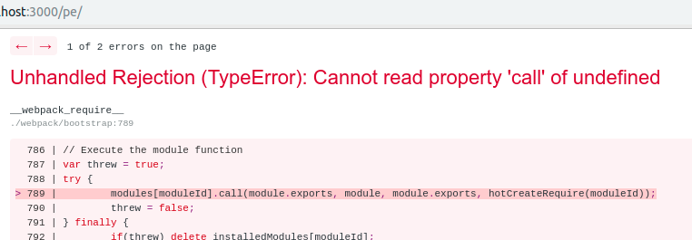

# :fireworks: Aprendiendo.la SSR

# :pushpin:  Introduction

This README describes how to develop Aprendiendo.la with Next JS. The main reasons that this project was created, because the previous version of the project doesn't support SEO, also it didn't render the most features that the team have done by reason of cache.

# :construction: Caution

Before we start, it's important to mention that there is several error on develop mode.
It's necessary to fix this on some time :pray:.

    - This happens every time we charge a new page.

# Step-by-Step Instructions

Following these instructions you should be able to install and run the project.

1.  Clone this project from the repository.

        git clone git@bitbucket.org:aprendiendola_platform/website-ssr.git

2.  Install all the dependencies.

        yarn

3.  Add the `.env` file (Ask this file to the code owner or the rest of the team).

4.  Run it.

        yarn dev

## Authors

- **Alberto Escala** - _Initial work_ - [Github](https://github.com/albertoescala)
- **Gian Ramirez** - [Github](https://github.com/zendostrike)
- **Rafael Becerra** - [Github](https://github.com/zendostrike)

### Final recomendations :alien:

- We are using [Atomic Design]('http://bradfrost.com/blog/post/atomic-web-design/'). Please continue with this design system.
- Use [Styled components]('https://github.com/styled-components/styled-components').
- You MUST commit using `yarn commit` instead of `git commit -m "..."` or `git cz` if you run commitizen globally
